# Teste Frontend AppMasters

Teste frontend para App Masters,

Precisamos implementar o frontend para apresentar uma lista de jogos, que será fornecida por uma API.

Porém, essa API é estranha… não tem documentação, dá uns erros, ora responde, ora falha, pede um `header`👀 lá... mas, temos certeza que você conseguirá ainda assim fazer um projeto incrível!

## Deploy

Para acessar esse projeto em produção acesse:

📍 <a href="https://app-masters-test.vercel.app/" target="_blank" > Teste App Marters</a>

# Layout

## 🗒️ Lista de Games

[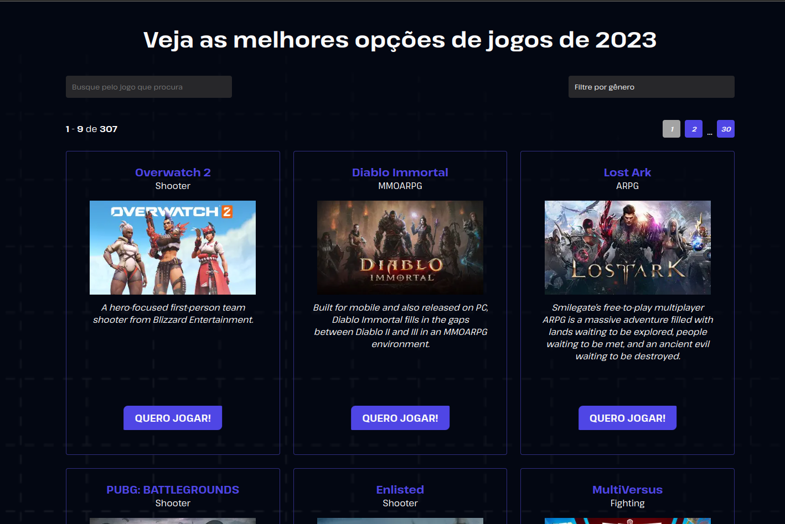]()

## Lista de Favoritos

[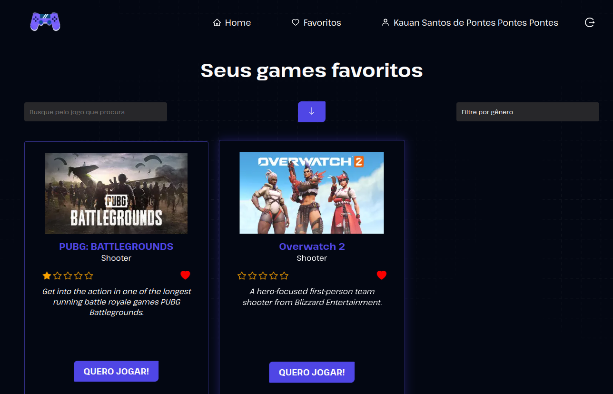]()

## Modal

[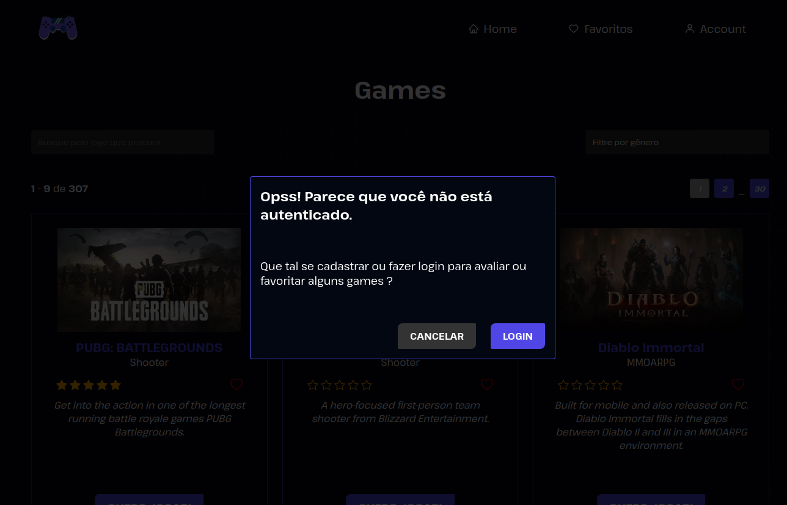]()

## Auth Page

[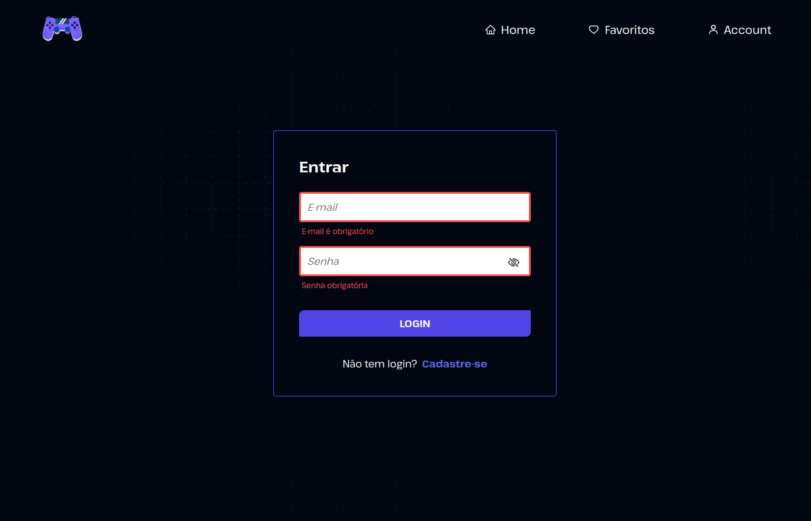]()

## Account Page

[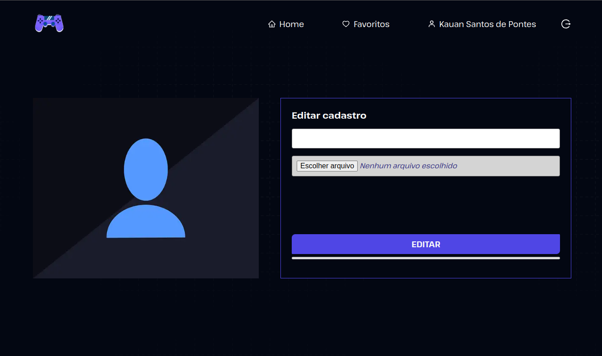]()

## 🪹 Empty List

[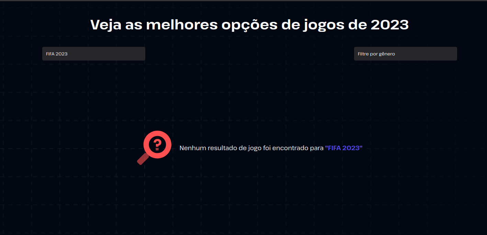]()

## 🪹 Empty Favorites

[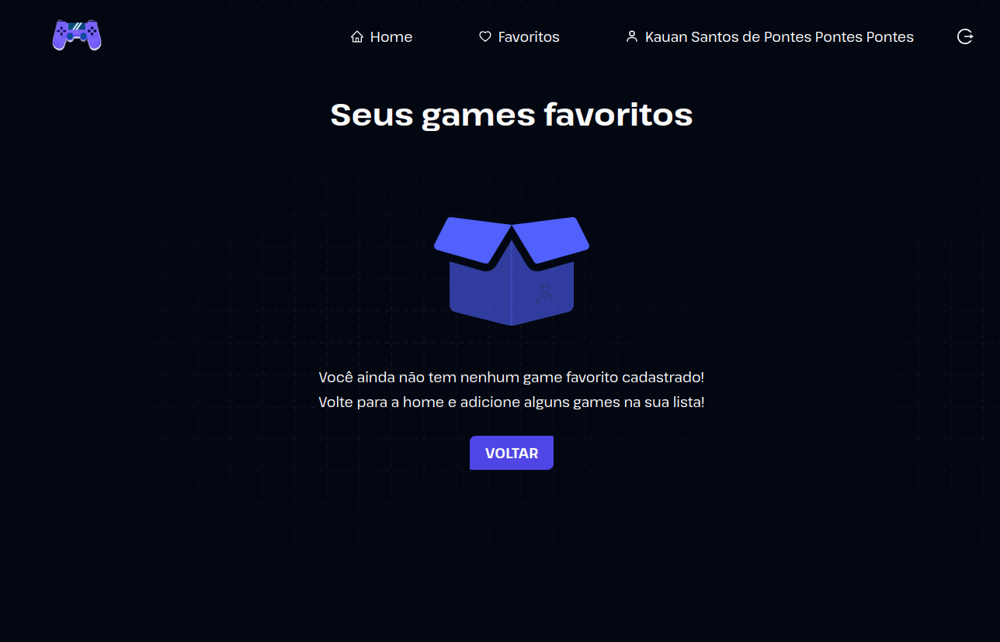]()

## 🔋 Loading

[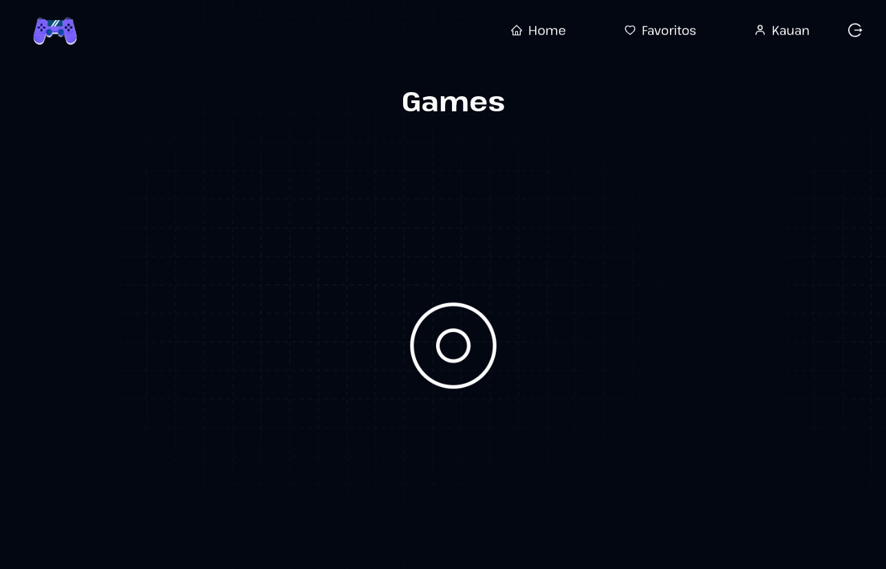]()

## 🚫 Dont Authenticated

[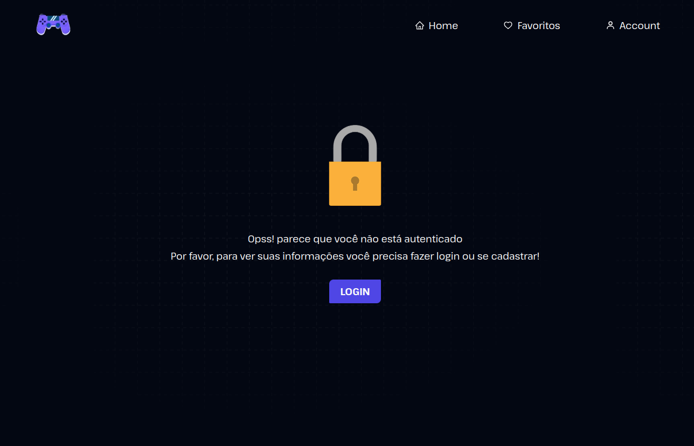]()

## ❌ Server Error

[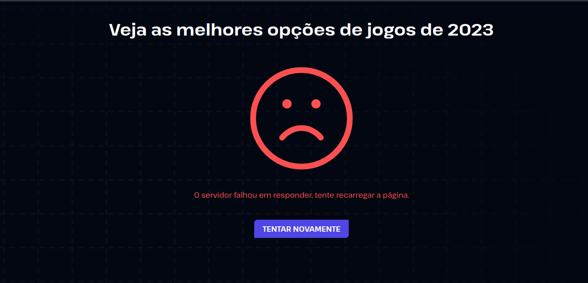]()

## ❌ Error

[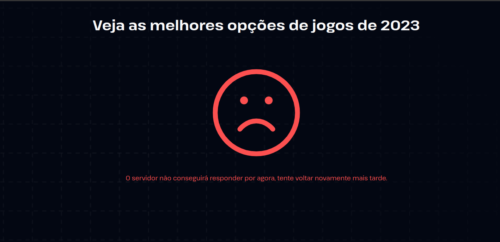]()

## 🚫 Not Found 404

[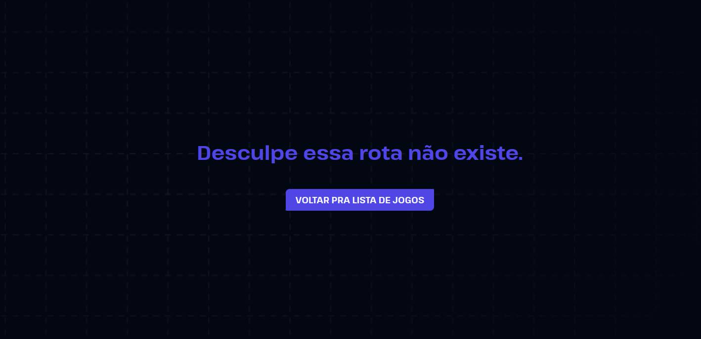]()

## Requisitos

### - PRIMEIRA ETAPA

- ✅ O projeto deve ser feito usando React ou Next.JS

- ✅ Obter a lista de jogos em `/data`

- ✅ Apresentar um loader enquanto os dados são obtidos

- ✅ Apresentar os jogos em três colunas (no computador)

- ✅ Em cada card apresentar o título e imagem pelo ao menos

- ✅ Lidar com a responsividade, para que fique bem apresentado no computador, tablets ou celular

- ✅ Quando a API retornar o `status code` 500, 502, 503, 504, 507, 508 ou 509 apresentar ao usuário `O servidor fahou em responder, tente recarregar a página`

- ✅ Caso a API retorne outros erros, apresentar `O servidor não conseguirá responder por agora, tente voltar novamente mais tarde`

- ✅ Ao realizar uma chamada, não esperar mais que 5 segundos pelo retorno. Se os dados demorarem mais de 5 segundos para retornar apresentar `O servidor demorou para responder, tente mais tarde`

- ✅ Sempre que apresentar uma mensagem para o usuário, ou tiver os dados em mãos para apresentar, ocultar o loader

- ✅ Incluir um campo de busca, que permite localizar jogos pelo título, com busca case insensitive

- ✅ Uma vez que tenha os dados em mãos, veja quais `genre` foram retornados e permita ao usuário selecionar um deles, e então filtre para exibir apenas jogos do gênero selecionado

### - SEGUNDA ETAPA

- ✅ Utilizar Firebase para realizar autenticação usando email/senha

- ✅ Ter um 🩶 para o usuário favoritar o jogo diretamente na lista, ficando vermelho quando marcado
- ✅ Salvar no firebase os jogos favoritos do usuário, no realtime ou firestore

- ✅ Ter um botão “Favoritos” que apresenta apenas jogos favoritados, permitindo ainda buscar e filtrar estes jogos. Pode ser na própria lista já apresentada ou em uma separada se preferir.

- ✅ Ao lado do coração, ter ★★★★ para o usuário avaliar o jogo, podendo marcar de uma em uma. Ou seja, ele pode escolher 1, 2, 3 ou as 4.

- ✅ Ter uma forma de ordenar por avaliação, vendo os melhores (ou piores) primeiro, clicando novamente para inverter a ordem.

- ✅ Ao carregar a interface, deixar o ❤️ vermelho para os itens favoritos e as ⭐️ amarelas nos itens avaliados
- ✅ Ao acessar sem estar autenticado, os ícones 🩶 e ★ deverão estar visíveis, mas ao clicar irá solicitar a autenticação

- ✅ 👉 Ao obter os jogos da API e os dados do firebase, apresentar. Manter o loading para os jogos. Não precisa de loading enquanto espera o firebase, até porque o firebase devolverá os dados mais rapidamente e pode ser complicado “esperar o firebase” se estiver “escutando o firebase”.

- ✅ A autenticação deve acontecer na rota `/auth/` do frontend, usando o provedor “E-mail/senha” do firebase, onde o usuário poderá criar uma conta ou acessar a conta já existente (se mantendo apenas nesta rota)

- ✅ Escolher um item para aplicar uma animação com CSS, pode ser ao favoritar, ou avaliar, ou quando os itens surgirem

- ✅ Publicar seu projeto online para testarmos (na mesma url de antes)

## Tecnologias utilizadas

- Nextjs
- React
- Typescript
- Javascript
- Styled-Components
- React Query
- React Hook Form
- Yup
- Firebase
- Nookies
- Axios
- Axios Mock Adapter

## Variáveis de Ambiente

Para rodar esse projeto, você vai precisar adicionar as seguintes variáveis de ambiente no seu .env.local

`DEV_EMAIL=<email>`

---


`API_KEY=`

`AUTH_DOMAIN`

`PROJECT_ID`

`STORAGE_BUCKET`

`MESSAGING_SENDER_ID`

`APP_ID`

Acesse <a href="https://firebase.google.com/?hl=pt" target="_blank">Firebase</a> e crie a sua aplicação utilizando a forma de autenticação Email/Senha depois adicione o Firebase store no projeto juntamente com o storage.

Criando a aplicação eles vão te devolver suas credenciais como o exemplo abaixo:
[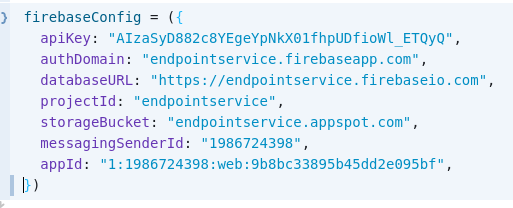]()


E você armazena elas no .env.local.

Depois so startar o projeto.


## Rodando Localmente

```bash
$ git clone https://github.com/zkauansantos/test-appMasters.git

$ cd test-appMasters

$ npm install ou yarn install

$ npm run dev ou yarn dev
```
